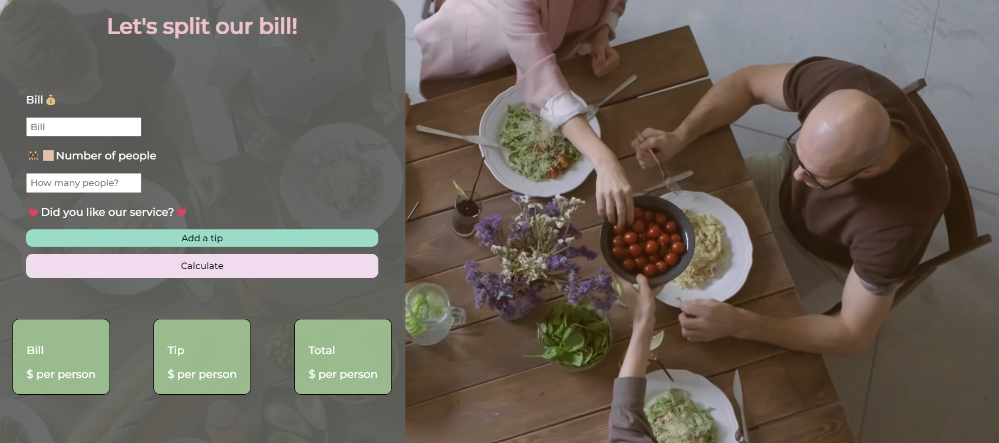

# Bill-Splitter-App

Bill Splitter Web Application designed to simplify the process of splitting bills among groups. Users can input the total bill amount, the number of people, and choose to add a tip based on the service received. The application calculates the total amount each person needs to pay, including their share of the tip. 

## Features:
* User Input for Bill and People Count: Allows users to enter the total bill amount and the number of people sharing the bill.
* Tip Addition Options: Users can choose to add a tip based on the quality of service, with options ranging from 10% to 30%.
* Dynamic Calculations: Upon entering the details and pressing the calculate button, the app dynamically calculates the amount each person owes, including their share of the tip.

## Learning Outcomes:
* Form Handling and Event Listeners in JavaScript
* Integration of External Libraries

## Technologies Used:
* HTML for structuring the web page.
* CSS for styling and responsive design.
* JavaScript for dynamic interactions and processing logic.
* SweetAlert2 for enhanced alert boxes.

## Link to the app:
https://smart-split-bill.glitch.me/ 
